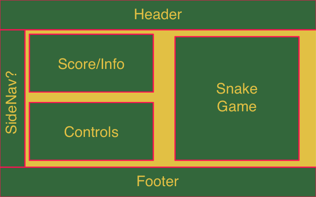
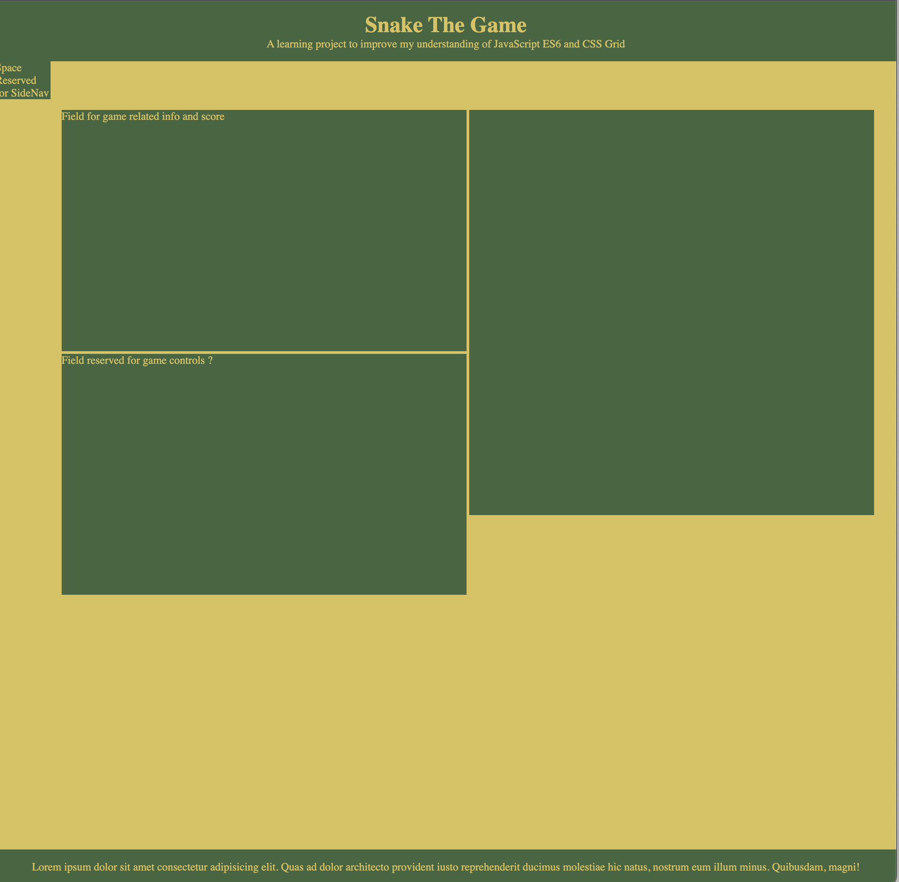
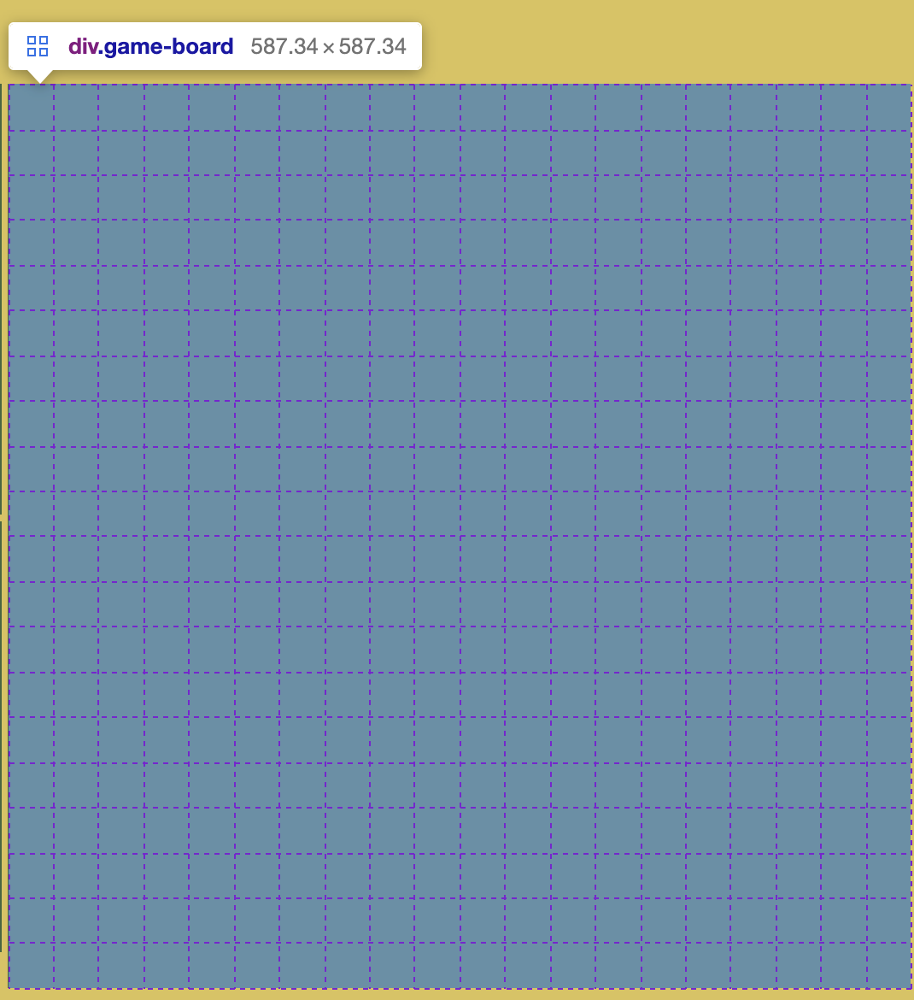

# Snake Game #
This project was started as a learning curve to increase my understanding of javascript ES6

## Goals ##
- [X] Create a basic site layout to house the game
  - [X] Use of CSS grid to house the game and the main sections
- [X] Create a X by X CSS grid gameboard where the game can be played
- [ ] Create Basic Snake game
  - #### Snake ####
    - [ ] Draw the snake on the board
    - [ ] Make the snake controlable with the keyboard
  - #### Food ####
    - [ ] Generate a piece of food at a random location on the board
    - [ ] Make the snake grow when it eats the food
  - #### Stretch Goals for game ####
    - [ ] Increase dificulty -> Snake goes faster at x score
    - [ ] Have some sort of powerup
       - Snake changes color and is immune to collision for x seconds ?
       - Snake Gains double score for food eaten ?
       - Snake size will temporarily reduce when food is eaten but score will go up ?

## Roadmap ##
- [X] Create a basic layout for the site 

- [X] Create the HTML
- [X] Use CSS Grid to achieve the inner site layout
  - Overruled this idea, added a game container that uses css Grid to house a control, info and gameboard panel

- [X] Have a CSS grid for the gameboard *20x20 ? 40x40 ?*
  - CSS grid is amazing ?

  - [This](https://cssgrid-generator.netlify.app) is such a usefull tool untill I wrap my head around it
  - Added the CSS aspect ratio 1/1 so it's always a square shape
  - Added a max height so it doesn't overflow outside of the window
        - Nobody likes vertical scrollbars, right ?
- [X] Reserve some space to turn it into an actual website
   - [X] Place to create a nav
   - [X] Place reserved for header
   - [X] Place reserved for footer
   - [ ] Place reserved for bloglike content about the creation ?
     - Kind of have the rest of the page for this ?

- [ ] add a gameloop
  - [ ] The gameloop updates the logic
  - [ ] Displays the logic on the board
  - [ ] Is controlled by a play/pause button in the controls center
     - [ ]First time button says start, then play/pause, when the game is over it says start again